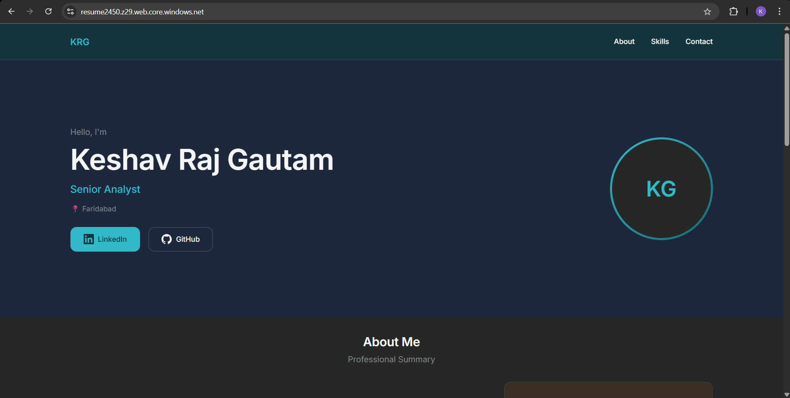
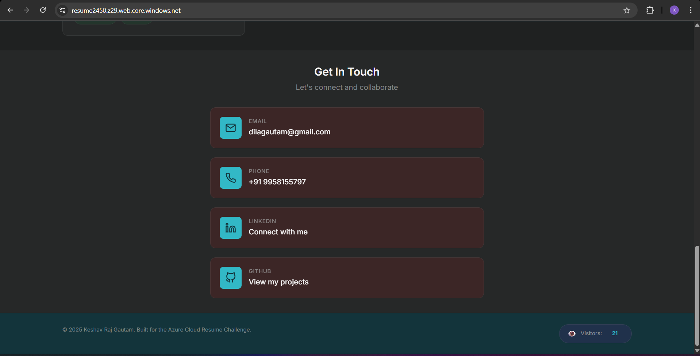
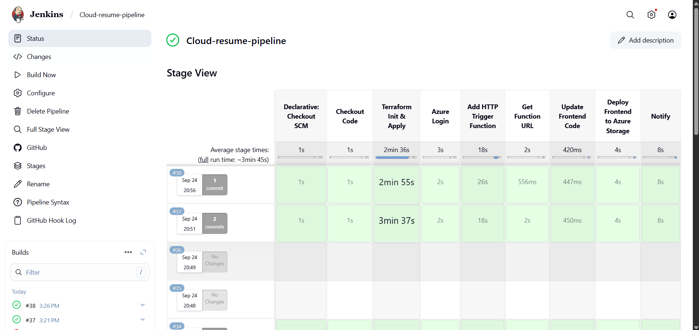
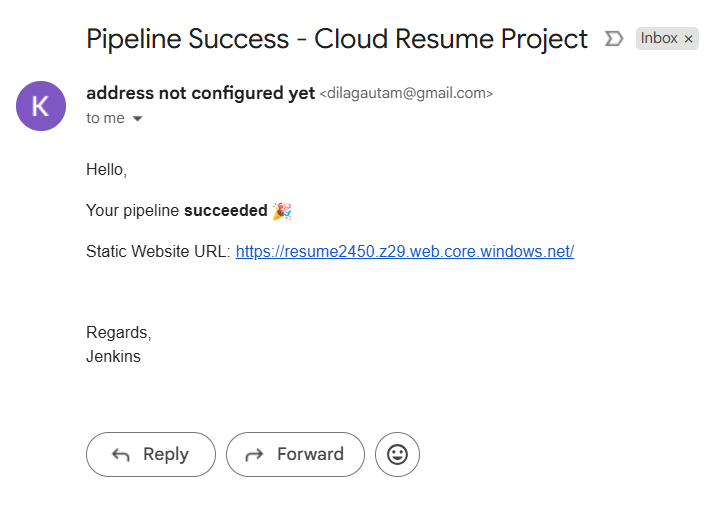

# Cloud Resume Challenge - Azure Edition

This project is my implementation of the Cloud Resume Challenge using Azure. It consists of a personal resume website with a visitor counter, infrastructure as code (IaC) automation, and a CI/CD pipeline.

## Project Overview

The project includes:  

- A **resume website** hosted on Azure Storage  
- A **visitor counter** implemented using an Azure Function app and Cosmos DB  
- **Infrastructure as Code** written in Terraform with reusable modules for the Storage account, Function app, and Cosmos DB  
- A **CI/CD pipeline** configured in Jenkins, triggered via GitHub webhook, to automate deployments whenever code is updated  

## Architecture

1. Terraform provisions the necessary Azure resources:  
   - Storage account for hosting the website  
   - Function app for handling visitor counter requests  
   - Cosmos DB for storing visitor data  

2. Jenkins runs on a local server, exposed via Ngrok for GitHub webhook integration  

3. On each GitHub commit, the Jenkins pipeline executes the following stages:  
   1. Checkout SCM  
   2. Checkout Code  
   3. Terraform Init and Apply  
   4. Azure Login  
   5. Add HTTP Trigger Function  
   6. Get Function URL  
   7. Update Frontend Code  
   8. Deploy Frontend to Azure Storage  
   9. Notify  

This ensures that infrastructure and frontend updates are automatically deployed whenever changes are pushed to the repository.  

## Screenshots

Here is a visual overview of the project:

### 1. Resume Website

### 2. Visitor Counter in Website

### 3. Jenkins Pipeline

### 4. Mail Notification from Jenkins

## Technologies Used

- Azure Storage  
- Azure Function App  
- Cosmos DB  
- Terraform with reusable modules  
- Jenkins  
- Ngrok  
- GitHub  

## Notes

- The Terraform modules are designed for reuse in other projects  
- The pipeline ensures that the website and infrastructure remain up to date with minimal manual intervention
